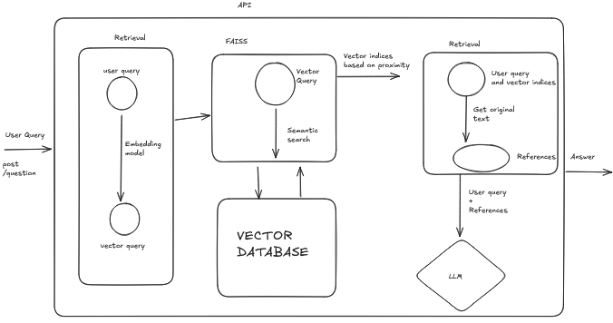
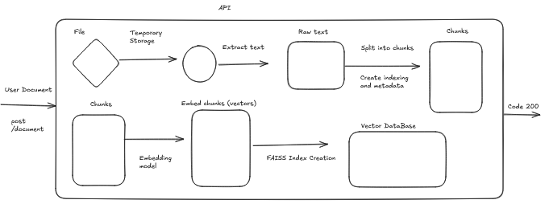

# RAG System Interface

A comprehensive Retrieval-Augmented Generation (RAG) system that allows users to upload PDF documents, ask questions about their content, and get AI-powered answers with source references. Built with FastAPI for the backend and Streamlit for the user interface.

## Features

- **Document Upload**: Upload multiple PDF documents for processing
- **Document Processing**: Automatic text extraction, chunking, and vector embedding
- **Question Answering**: Ask questions about uploaded documents and get AI-generated answers
- **Source References**: View the exact document chunks used to generate answers
- **Validation Tests**: Automated testing to verify system performance
- **Dashboard**: Visualize system metrics and document statistics
- **Conversation History**: Track and review previous Q&A sessions

## System Architecture
1. Question Answering Flow

This diagram illustrates the flow of how a user query is processed. The query is embedded into a vector, searched within the FAISS vector database, and relevant text chunks are retrieved. These chunks, along with the original query, are then passed to the LLM to generate a final answer.

<p align="center">  </p>

Figure 1: Flow of processing a user query through embedding, FAISS retrieval, and LLM answer generation.

2. Document Ingestion Flow

This diagram shows the pipeline of how a document upload is handled. The file is temporarily stored, its text is extracted, split into chunks, and then embedded into vectors. These embeddings are indexed in FAISS, creating the vector database used for retrieval during queries.

<p align="center">  </p>

Figure 2: Steps of document ingestion, from upload to vector database indexing.

## Project Structure

```
rag_system/
├── .env                 # Environment variables
├── .gitignore           # Git ignore rules
├── app/                 # Core application code
│   ├── api/             # API endpoints and schemas
│   │   ├── __init__.py
│   │   ├── routes.py    # FastAPI route definitions
│   │   └── schemas.py   # Pydantic models for request/response
│   ├── core/            # Core utilities
│   │   ├── __init__.py
│   │   ├── config.py    # Configuration management
│   │   └── logger.py    # Logging configuration
│   └── services/        # Business logic services
│       ├── __init__.py
│       ├── document_processor.py  # PDF text extraction and chunking
│       ├── embedding_service.py   # Vector embeddings and FAISS index
│       ├── retrieval_service.py    # Similarity search
│       └── llm_service.py          # Language model integration
├── logs/                # Application logs
├── vector_db/           # Vector database storage
├── files/               # Test files
│   └── LB5001.pdf       # Sample test document
│   └── diagram_1.png    # Diagram 1
│   └── diagram_2.png    # Diagram 2
├── main.py              # FastAPI application entry point
├── test_rag.py          # Test script for validation
├── app_streamlit.py     # Streamlit UI application
├── requirements.txt     # Python dependencies
└── README.md            # This file
```

## Prerequisites

- Python 3.8 or higher
- pip package manager
- Google Gemini API key (for LLM services)

## Installation and Setup

1. **Clone the repository**:
   ```bash
   git clone <repository-url>
   cd rag_system
   ```

2. **Create a virtual environment**:
   ```bash
   python -m venv venv
   source venv/bin/activate
   ```

3. **Install dependencies**:
   ```bash
   pip install -r requirements.txt
   ```

4. **Set up environment variables**:
   Create a `.env` file in the project root with the following content:
   ```env
        APP_NAME=RAG System
        ENVIRONMENT=development
        DEBUG=True
        LOG_LEVEL=INFO
        VECTOR_DB_PATH=vector_db
        EMBEDDING_MODEL=all-MiniLM-L6-v2
        LLM_PROVIDER=google
        LLM_MODEL=gemma-3-12b-it
        LLM_API_KEY=your_google_gemini_api_key_here
        CHUNK_SIZE=500
        CHUNK_OVERLAP=50
   ```

   Replace `your_google_gemini_api_key_here` with your actual Google Gemini API key.
   You can get a key here: https://aistudio.google.com/app/apikey
   The gemma model is free to use.

## Running the Application Locally

The system consists of two main components: the FastAPI backend and the Streamlit frontend. You need to run both components simultaneously.

### 1. Start the FastAPI Backend

In a terminal, run:
```bash
python main.py
```

The API will start at `http://localhost:8000`.

### 2. Start the Streamlit Frontend

In a separate terminal, run:
```bash
streamlit run app_streamlit.py
```

The Streamlit interface will open in your browser at `http://localhost:8501`.

## Running with Docker

Alternatively, you can also run the project using Docker.

## Running Tests

To run the validation tests:

```bash
python test_rag.py
```

This will:
1. Upload the test document (`tests/LB5001.pdf`)
2. Process the document
3. Ask a series of predefined questions
4. Evaluate the answers against expected responses
5. Display a detailed report of the test results

You can also run tests directly from the Streamlit interface:
1. Upload at least one document
2. Navigate to the "Validation Tests" page
3. Click "Run Validation Tests"
4. View the results in the interface

## Usage Guide

### 1. Document Upload
- Navigate to the "Document Upload" page
- Select one or more PDF files using the file uploader
- Click "Process Documents"
- Wait for processing to complete (progress bar will show status)
- View processing results including number of chunks generated

### 2. Chat with Documents
- Navigate to the "Chat" page
- Select an uploaded document from the available list
- Enter your question in the text input field
- Click "Send Question"
- View the AI-generated answer along with source references
- Continue the conversation or start a new one
- Use "Clear History" to reset the conversation

### 3. Validation Tests
- Navigate to the "Validation Tests" page
- Ensure at least one document is uploaded
- Click "Run Validation Tests"
- View detailed test results including:
  - Overall pass/fail status
  - Individual question scores
  - Success rate metrics
  - Detailed reasoning for each evaluation

### 4. Dashboard
- Navigate to the "Dashboard" page
- View system metrics including:
  - Number of uploaded documents
  - Total chunks generated
  - Total document size
  - Document distribution charts
  - Chat statistics (questions asked, responses generated)

## API Endpoints

The FastAPI backend provides the following endpoints:

### `GET /`
Health check endpoint to verify the API is running.

### `POST /documents`
Upload and process PDF documents.
- **Request**: Multipart form data with PDF files
- **Response**: JSON with processing results
  ```json
  {
    "message": "Documents processed successfully",
    "documents_indexed": 2,
    "total_chunks": 150
  }
  ```

### `POST /question`
Ask a question about the uploaded documents.
- **Request**: JSON with question
  ```json
  {
    "question": "What should be done if damage is found when receiving the motor?"
  }
  ```
- **Response**: JSON with answer and references
  ```json
  {
    "answer": "Report any damage immediately to the commercial carrier that delivered the motor.",
    "references": ["Source text chunk 1", "Source text chunk 2"]
  }
  ```

## Environment Variables

| Variable | Description | Default |
|----------|-------------|---------|
| `APP_NAME` | Application name | RAG System |
| `ENVIRONMENT` | Application environment (development, production, etc.) | development |
| `DEBUG` | Debug mode flag | True |
| `LOG_LEVEL` | Logging level (DEBUG, INFO, WARNING, ERROR, CRITICAL) | INFO |
| `VECTOR_DB_PATH` | Path to vector database | vector_db |
| `EMBEDDING_MODEL` | Sentence embedding model | all-MiniLM-L6-v2 |
| `LLM_PROVIDER` | LLM service provider | google |
| `LLM_MODEL` | LLM model name | gemma-3-12b-it |
| `LLM_API_KEY` | Google Gemini API key | (required) |
| `CHUNK_SIZE` | Maximum chunk size in characters | 500 |
| `CHUNK_OVERLAP` | Overlap between chunks | 50 |


## How It Works

1. **Document Processing**:
   - PDFs are uploaded and text is extracted
   - Text is split into overlapping chunks
   - Each chunk is converted to a vector embedding
   - Embeddings are stored in a FAISS vector database

2. **Question Answering**:
   - User question is converted to an embedding
   - Similarity search finds relevant document chunks
   - Relevant chunks are passed to the LLM
   - LLM generates an answer based on the provided context
   - Original chunks are returned as source references

3. **Validation Testing**:
   - Predefined questions are sent to the system
   - Generated answers are compared to expected answers
   - Google Gemini evaluates answer quality
   - Detailed scoring and reasoning is provided

## Acknowledgments

- FastAPI for the backend framework
- Streamlit for the user interface
- Google Gemini for language model services
- FAISS for vector similarity search

- Sentence Transformers for text embeddings
